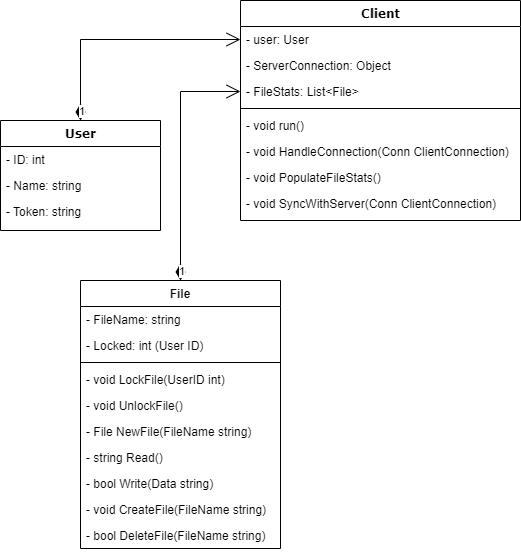
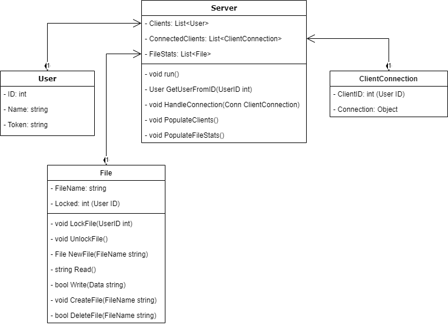
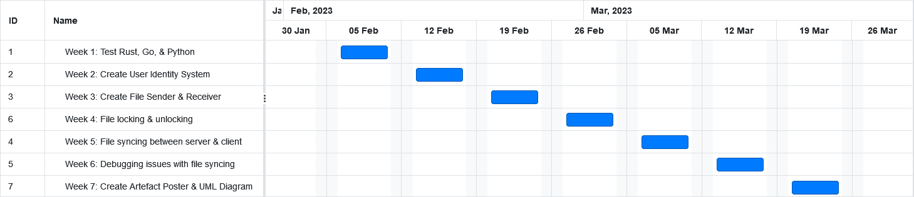

# File Sharing Artefact
## By Rian Rutherford - _RR262471; 6th February 2023_

***1,438 total words***

# Problem

_152 words_

There are many cloud storage solutions available: Dropbox [[6](#6-dropbox-2008-dropbox-available-at-httpswwwdropboxcom-accessed-05-february-2023)], Google Drive [[12](#12-google-2012-google-drive-available-at-httpswwwgooglecomintlen-gbdrivedownload-accessed-05-february-2023)], and OneDrive [[16](#16-microsoft-2007-onedrive-available-at-httpswwwmicrosoftcomenmicrosoft-365onedriveonline-cloud-storage-accessed-05-february-2023)]. They all provide permission access levels, but they don't provide file locking. This is a problem when you want to prevent two or more users accidentlly working on the same binary file at the same time.

For word documents this normally isn't a problem because they have a built-in editor that allows more than 1 user to edit at a time. But it is a problem for unsupported formats like FBX, PNG, and PSD.

There are systems that do support file locking. Those being Software Configuration Management [[22](#22-wikipedia-available-at-httpsenwikipediaorgwikisoftware_configuration_management-accessed-05-february-2023)] [[14](#14-guru99-available-at-httpswwwguru99comsoftware-configuration-management-tutorialhtml-accessed-05-february-2023)] solutions like Plastic [[5](#5-codice-software-2006-plasticscm-available-at-httpswwwplasticscmcom-accessed-05-february-2023)], Perforce Helix TeamHub [[17](#17-perforce-helix-teamhub-available-at-httpswwwperforcecomproductshelix-teamhubpricing-accessed-05-february-2023)], and Subversion [[3](#3-apache-2000-subversion-available-at-httpssubversionapacheorg-accessed-05-february-2023)]. But each one of these has their own problems.
- Plastic is $7-$23 per user per month depending on the plan.
- Helix TeamHub from Perforce is $23+ per user per year (varies depending on the plan).
- Subversion is old and doesn't have any good user interfaces.

# Artefact Solution

_392 words_

I plan to make a client and server solution that that can be privately hosted by anyone. It's a file storage and syncing solution like Cloud Storage, but with file locking which is commonly found in Software Configuration Management (also known as SCM) systems.

The user will sync/connect a folder to a server via the command line from the client. Once connected to the server, that folder on their computer will mirror every change that's made on the server.

When a user saves any changes made to a file, it is automatically synced to the server and all connected clients. If a user locks a file, then anyone who saves changes to the locked file will have their changes rejected by the server and their unauthorized changes reverted locally.

Artefact Client Features:
- Syncing of file & folder directory with the server the client is connected to.
- When a file is saved, the changes are instantly synced to the server.
- Files can be locked if not already locked.
- Files can be unlocked by the client who locked them.

Artefact Server Features:
- Files are stored on the server.
- When a changed file is synced to the server, the server broadcasts the changes to all connected clients.
- If a file is locked by a client, then any new changes made by a different client will be rejected by the server.
- Optional: Clients can force override of locked files.
- Optional: The server can be configured to have lifetimes for how long files will remain locked before they unlock automatically.
- Optional: When a file is synced to the server, it's automatically locked and assumes the user will continue to make edits.

_Legend - Optional means a feature that would be nice to have, but is outside of scope and will only be added provided there is still time remaining._

The optional features are more challenging to implement, but would make a great addition if I get the time. I used Perforce during one of my recent GAMJAMs [[15](#15-lordunderworld-2022-knight-watch-available-at-httpslordunderworlditchioknight-watch-accessed-05-february-2023)]. I didn't have any of the optional features, as suggested above, available in Perforce which caused problems. People are forgetful, they forget to lock files and they forget to unlock them. By making locking automatic on saves and giving it specified lifetimes, even if people forget their files are still appropriately locked and unlocked for them most of the time.

# Artefact Defence

_185 words_

My artefact serves a purpose of being a free, self hosted, network file sharing solution that can will run on almost any computer. It operates like normal file storage allowing it to be used with a wide array of applications.

For people that want a simple home Network-Attached Storage (NAS) [[4](#4-bigelow-stephen-j-ben-lutkevich-and-garry-kranz-2022-what-is-network-attached-storage-nas-a-complete-guide-available-at-httpswwwtechtargetcomsearchstoragedefinitionnetwork-attached-storage-accessed-at-06-february-2023)] [[23](#23-wikipedia-network-attached-storage-available-at-httpsenwikipediaorgwikinetwork-attached_storage-accessed-at-06-february-2023)], this will allow them to repurpose their old phone, laptop, or desktop instead of buying a NAS that costs them £150 to £4k [[2](#2-amazon-network-attached-storage-available-at-httpswwwamazoncouknetwork-attached-storagebieutf8node430553031-accessed-at-06-february-2023)].

This also provides people & businesses the option to build their own NAS systems from new or old hardware without relying on on expensive software or vendor locking hardware & software.

The simple nature of the artefact will also mean that it should be easy to mod and integrate into other pipelines and software's.

During the recent COVID pandemic many business went remote and started using Cloud services [[10](#10-gokarna-mayank-2021-reasons-behind-growing-adoption-of-cloud-after-covid-19-pandemic-and-challenges-ahead-available-at-httpsarxivorgftparxivpapers2103210300176pdf-accessed-at-06-february-2023)]. In my opinion cloud and internet services as a whole are very young in the remote collaboration sector, because until recently most companies had no reason to facilitate staff working offsite, and so the technical issues with doing so haven't been thoroughly explored yet.

# Artefact Architecture

_65 words_

### Client Design

### Client Internet Packet Specification
Required Fields:
1. User ID - _The users public ID so it can be identified_.
2. User Token - _Used to validate the user owns the account_.
3. Request Type - _Decides how the sent package is treated_.
4. Package - _Data to be used by the server_.

### Server Design

### Server Internet Packet Specification
Required Fields:
1. Request Type - _Decides how the sent package is treated_.
2. Package - _Data to be used by the client_.

# Development Plan

_364 words_

I plan on doing a simple test on Python 3 [[18](#18-python-1991-python-available-at-httpswwwpythonorg-accessed-05-february-2023)], Rust [[19](#19-rust-2010-rust-available-at-httpswwwrust-langorg-accessed-05-february-2023)], and Go [[11](#11-google-2009-go-available-at-httpsgodev-accessed-05-february-2023)] to see which is better suited to developing this artefact. Python is easy to use and has a lot of supporting libraries as seen by how popular it is [[9](#9-github-2022-the-top-programming-languages-available-at-httpsoctoversegithubcom2022top-programming-languages-accessed-05-february-2023)]. Go has great support for making server software because that is what it was made for [[13](#13-google-2019-go-for-cloud--network-services-available-at-httpsgodevsolutionscloud-accessed-05-february-2023)]. Rust has a low overhead and if suitable would enable the software to run more efficiently and on more systems like phones because of the lower hardware requirements [[19](#19-rust-2010-rust-available-at-httpswwwrust-langorg-accessed-05-february-2023)].

Each of the three languages will go through these tests:
1. Make a TCP client & server to test the difficulty of coding client & server.
2. Make a concurrent/threaded console application to test the difficulty of implementing concurrency into the artefact.
3. Parse JSON or serialized data to test the difficult of transmuting data to bytes for sending and receiving over the internet.
4. Make a script that reads & writes to a file to test the difficulty of doing so.
5. Test the difficulty of reading input from the console.

The language that provides the best ease of use between all 5 tests will be used to develop the artefact. If there is a draw between any of the languages then they're favoured in order: Rust over Go, and Go over Python 3. The winning language will be used to develop the artefact because it will have proven suitable for this use case.

For developing the artefact I have created a Gantt Chart to estimate how long it will take to make.

Weekly Breakdown:
1. Week 1 is where I test and decide the appropriate programming language for the artefact.
2. Week 2 is when I create backend systems for identifying users connected to a server.
3. Week 3 is when I create the base code that will handle sending files between the client & server.
4. Week 4 is when I add file locking based on user identities.
5. Week 5 is when I functionality for syncing files between client & server.
6. Week 6 is reserved for debugging the artefact.
7. Week 7 is when the artefact architecture UML diagram & technical poster are created.

# Practice Research

_280 words_

While planning out a demo, artefact, or MVP it is very productive to use a Gantt Chart or plan out exactly what you will do because it allows for full focus on developing the system without any interruptions.

Planning everything out has a drawback though, it doesn't incorporate customer feedback into the design of the product or service. The industry standard for developing software is to use Agile based or Agile inspired development. The first two principles of Agile are about the customer [[1](#1-agile-manifesto-2001-principles-behind-the-agile-manifesto-available-at-httpsagilemanifestoorgprincipleshtml-accessed-06-february-2023)], that's how important they are to the development of a system.

Once my artefact is complete I plan on using Extreme Programming [[20](#20-wells-don-1996-extreme-programming-a-gentle-introduction-available-at-httpwwwextremeprogrammingorg-accessed-at-06-february-2023)] methodology for the development cycle of the product/service. Extreme Programming (XP) is like Agile, but it has a specific order to things [[21](#21-wells-don-2000-extreme-programming-project-available-at-httpwwwextremeprogrammingorgmapprojecthtml-accessed-at-06-february-2023)]. XP integrates the consumer into the development cycle of the product or service.

Using XP I will add, remove, and change features of the system to match the consumer's needs. Business, individuals going GAMJAMs, and indie game development studios will be the target consumers that will be used to inform the design choices of the system to turn it from an artefact to a stable product & service that can be used in industry and by individuals.

Immediate candidates are the local Games Academy [[8](#8-falmouth-university-games-academy-available-at-httpswwwfalmouthacukdepartmentsgames-academy-accessed-at-06-february-2023)] and Falmouth Launchpad [[7](#7-falmouth-university-2014-available-at-httpswwwfalmouthacuklaunchpad-accessed-at-06-february-2023)]. At the Games Academy they teach students video game development and use version control, which makes them a target audience. Falmouth Launchpad supports start-ups, who use a wide array of cloud based services to start and run their businesses. Launchpad start-ups are a target audience because they use services like Google Drive, and OneDrive both of which don't support file locking - _the artefacts key feature_.

# Bibliography

##### [1] AGILE MANIFESTO. 2001. _Principles behind the Agile Manifesto_. Available at: https://agilemanifesto.org/principles.html [accessed 06 February 2023].

##### [2] AMAZON. _Network Attached Storage_. Available at: https://www.amazon.co.uk/network-attached-storage/b?ie=UTF8&node=430553031 [accessed at 06 February 2023].

##### [3] APACHE. 2000. _Subversion_. Available at: https://subversion.apache.org/ [accessed 05 February 2023].

##### [4] BIGELOW, Stephen J, Ben LUTKEVICH, and Garry KRANZ. 2022. _What is network-attached storage (NAS)? A complete guide_. Available at: https://www.techtarget.com/searchstorage/definition/network-attached-storage [accessed at 06 February 2023].

##### [5] CODICE SOFTWARE. 2006. _PlasticSCM_. Available at: https://www.plasticscm.com/ [accessed 05 February 2023].

##### [6] DROPBOX. 2008. _Dropbox_. Available at: https://www.dropbox.com/ [accessed 05 February 2023].

##### [7] FALMOUTH UNIVERSITY. 2014. Available at: https://www.falmouth.ac.uk/launchpad [accessed at 06 February 2023].

##### [8] FALMOUTH UNIVERSITY. _Games Academy_. Available at: https://www.falmouth.ac.uk/departments/games-academy [accessed at 06 February 2023].

##### [9] GITHUB. 2022. _The top programming languages_. Available at: https://octoverse.github.com/2022/top-programming-languages [accessed 05 February 2023].

##### [10] GOKARNA Mayank. 2021. _Reasons behind growing adoption of Cloud after Covid-19 Pandemic and Challenges ahead_. Available at: https://arxiv.org/ftp/arxiv/papers/2103/2103.00176.pdf [accessed at 06 February 2023].

##### [11] GOOGLE. 2009. _Go_. Available at: https://go.dev/ [accessed 05 February 2023].

##### [12] GOOGLE. 2012. _Google Drive_. Available at: https://www.google.com/intl/en-GB/drive/download/ [accessed 05 February 2023].

##### [13] GOOGLE. 2019. _Go for Cloud & Network Services_. Available at: https://go.dev/solutions/cloud [accessed 05 February 2023].

##### [14] GURU99. Available at: https://www.guru99.com/software-configuration-management-tutorial.html [accessed 05 February 2023].

##### [15] LORDUNDERWORLD. 2022. _Knight Watch_. Available at: https://lordunderworld.itch.io/knight-watch [accessed 05 February 2023].

##### [16] MICROSOFT. 2007. _OneDrive_. Available at: https://www.microsoft.com/en/microsoft-365/onedrive/online-cloud-storage [accessed 05 February 2023].

##### [17] PERFORCE. _Helix TeamHub_. Available at: https://www.perforce.com/products/helix-teamhub/pricing [accessed 05 February 2023].

##### [18] PYTHON. 1991. _Python_. Available at: https://www.python.org/ [accessed 05 February 2023].

##### [19] RUST. 2010. _Rust_. Available at: https://www.rust-lang.org/ [accessed 05 February 2023].

##### [20] WELLS, Don. 1996. _Extreme Programming: A gentle introduction_. Available at: http://www.extremeprogramming.org/ [accessed at 06 February 2023].

##### [21] WELLS, Don. 2000. _Extreme Programming Project_. Available at: http://www.extremeprogramming.org/map/project.html [accessed at 06 February 2023].

##### [22] WIKIPEDIA. Available at: https://en.wikipedia.org/wiki/Software_configuration_management [accessed 05 February 2023].

##### [23] WIKIPEDIA. _Network-attached storage_. Available at: https://en.wikipedia.org/wiki/Network-attached_storage [accessed at 06 February 2023].

# Tools

List of software & services used to make this document:
1. [Visual Studio Code](https://code.visualstudio.com/) (VSCode)
2. [Markdown PDF](https://marketplace.visualstudio.com/items?itemName=yzane.markdown-pdf) _- VSCode Extension_
3. [Online Gantt](https://www.onlinegantt.com/#/gantt)
4. [diagrams.net](https://app.diagrams.net/) _- used to make UML diagrams_